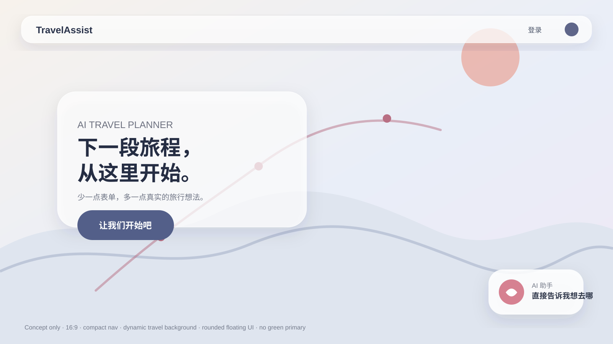
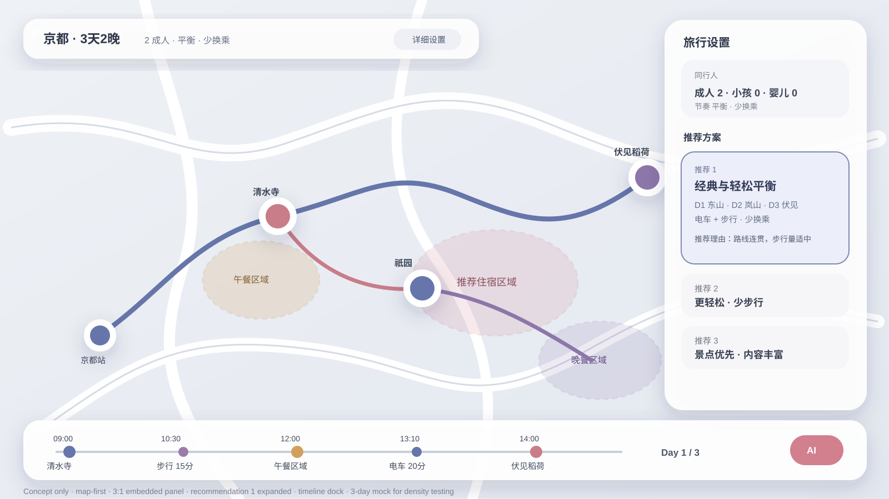
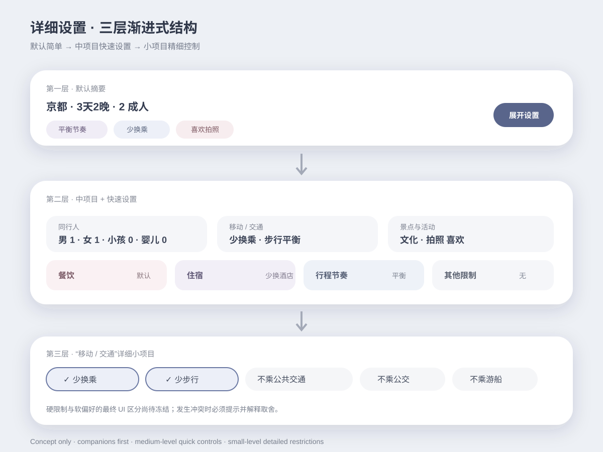
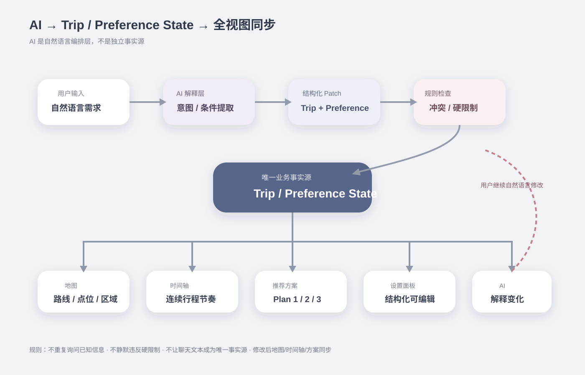

# TravelAssist 设计图资产

> 本目录保存可由 GitHub 直接预览和版本管理的视觉设计资产。

## 当前概念图

### 首页



设计依据：

- 极简、圆润、沉浸式
- 主 CTA“让我们开始吧”
- 小型顶部导航 / 登录入口
- 右下 AI 浮动入口
- 动态旅行背景方向
- 轻量日本气质
- 不使用绿色作为主视觉方案

### 行程主工作区



设计依据：

- 16:9 宽屏
- 地图是视觉主体
- 约 3:1 地图 / 右侧工作区
- 右侧面板镶嵌在地图上
- 上部详细设置、下部多方案
- 推荐 1 展开，2 / 3 默认精简
- 地图显示景点、交通、住宿区、午 / 晚餐区域
- 底部连续时间轴
- 3 天 2 晚仅作为 Mock 信息密度示例

### 偏好 / 详细设置



设计依据：

- 第一层：关键摘要
- 第二层：中项目 + 快速设置
- 第三层：小项目 / 详细限制
- 同行人优先
- 移动、景点活动、餐饮、住宿、节奏等中项目
- 少换乘、少步行、不乘公共交通 / 公交 / 游船等详细项

### AI 行程数据流



设计依据：

- AI 是自然语言编排层
- Trip / Preference State 是唯一业务事实源
- Map / Timeline / Recommendation / Settings / AI 同步
- 冲突和硬限制先验证再生成 / 重算

---

## 资产状态

当前 SVG 是根据截至 2026-09-04 的项目设计讨论重新整理的 **canonical repository diagrams**，用于保存已经明确的页面关系、布局和视觉方向。

聊天中曾生成过的独立渲染图片如果没有作为文件暴露给当前 GitHub 工作流，不能保证逐像素复原；因此这里优先保存可持续维护的 SVG 版本。后续若有原始 PNG / JPG / Figma 导出文件，可继续放入本目录，并在本索引中标注版本和来源。

## 命名规则

```text
<page-or-flow>-concept-vN.svg
<page>-wireframe-vN.svg
<page>-visual-vN.png
```

当前第一版为避免改链接，使用无版本号文件名；形成多版视觉方案后再增加版本化文件。

## 与代码的关系

- 设计图用于结构和视觉方向，不替代 Markdown 规格。
- 如果设计图与专题 Markdown 冲突，以最新正式 Markdown + `docs/decisions/confirmed-decisions.md` 为准。
- UI Pull Request 应附实现截图，并注明参考了哪张设计图。
