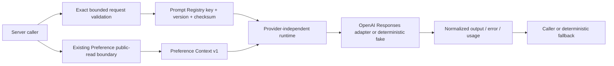

# AI Runtime Foundation v1

## Scope

TASK-076-A adds the first server-only AI runtime boundary. It does not mutate Planner state, execute tools, fetch arbitrary URLs, write preferences, or introduce a second Preference, Trip, or Planning AI contract.

## Runtime flow

## Reused contracts

- `PreferenceReadResultV1` and `LongTermPreferenceReadV1` remain the only long-term Preference read model.
- `readCurrentLongTermPreferenceForRequest` remains the authenticated public-read boundary and retains its response finalizer for refreshed cookies and private cache headers.
- Existing private auth helpers remain responsible for Bearer and Cookie authentication.
- Existing Planning AI compact and `DecisionRun` trace contracts are not replaced or mutated. Later orchestration work can map the normalized usage record into those existing traces.

## Provider and configuration boundary

`AiProvider` accepts stable instructions, a serialized bounded input, and safe trace identifiers. It returns either normalized text plus metadata or a normalized failure. No OpenAI response object crosses this boundary.

The production adapter uses the official OpenAI Node SDK and Responses API. It is guarded by `server-only`, sets `store: false`, supplies no tools, and reads configuration only on the server:

| Variable             | Rule                                              |
| -------------------- | ------------------------------------------------- |
| `OPENAI_API_KEY`     | Required for live calls; never public or returned |
| `OPENAI_MODEL`       | Required server-selected model                    |
| `OPENAI_TIMEOUT_MS`  | Optional, integer 1000–60000; default 15000       |
| `OPENAI_MAX_RETRIES` | Optional, integer 0–2; default 1                  |

SDK automatic retries are disabled. The adapter owns the bounded retry loop so the recorded retry count is exact. Only timeout, rate-limit, connection, and server-unavailable failures are retryable.

## Prompt Registry

The registry resolves the exact pair `travel_assistant_foundation@1.0.0`. Each immutable entry contains:

- stable key and semantic version;
- immutable instruction text;
- SHA-256 checksum;
- role and purpose;
- compatible `preference_context_v1` profile.

An unknown key/version or checksum mismatch fails closed as `AI_RUNTIME_INVALID_REQUEST`. Callers cannot supply system instructions, tools, provider model names, or URLs.

## Preference Context v1

The Context Builder consumes the existing Preference read result and sends only:

- context status (`anonymous`, `missing`, `present`, or `unavailable`);
- existing contract version and source metadata when present;
- the existing structured `PreferenceV1` value.

Revision zero with an empty value and no update time is a valid missing state. Explicit `false`, `neutral`, and omitted/unknown values remain distinct. Account/profile payloads, user IDs, and precise location are excluded. An unavailable Preference read does not fabricate defaults; it produces an unavailable context and allows the caller to retain deterministic behavior.

## Error and fallback model

The public error surface is limited to:

- `AI_PROVIDER_NOT_CONFIGURED`
- `AI_PROVIDER_TIMEOUT`
- `AI_PROVIDER_RATE_LIMITED`
- `AI_PROVIDER_UNAVAILABLE`
- `AI_INVALID_PROVIDER_RESPONSE`
- `AI_RUNTIME_INVALID_REQUEST`

Provider messages, stacks, raw bodies, and secrets are discarded. Runtime failure returns `deterministic_only` as the fallback mode and never fabricates an AI result.

## Usage and cost boundary

Every attempted provider call returns a normalized usage record with provider/model class, prompt identity/checksum, input/output/cached tokens when available, latency, retry count, status, safe `x-request-id`, trace ID, and correlation ID.

Pricing is deliberately not hardcoded. `pricingConfigVersion`, `estimatedCostMinor`, and `currency` remain null until an approved versioned pricing source exists. External telemetry/export remains under WBS 9.11.

## Security properties

- all AI runtime modules are server-only;
- no `NEXT_PUBLIC_OPENAI_*` variable exists;
- request input is an exact-key object and is limited to 32 KiB UTF-8;
- trace identifiers use a bounded allowlist;
- no arbitrary tools or URL retrieval are exposed;
- provider raw objects never enter returned results;
- deterministic tests inject an executor and make no network requests.
