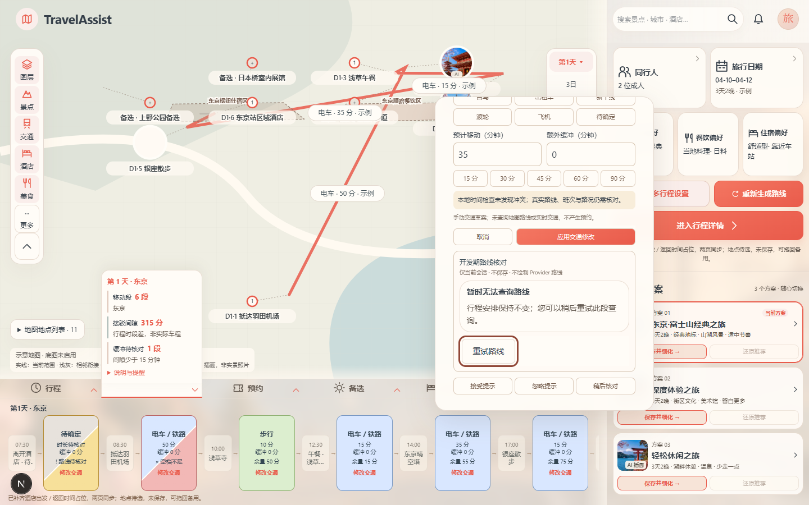
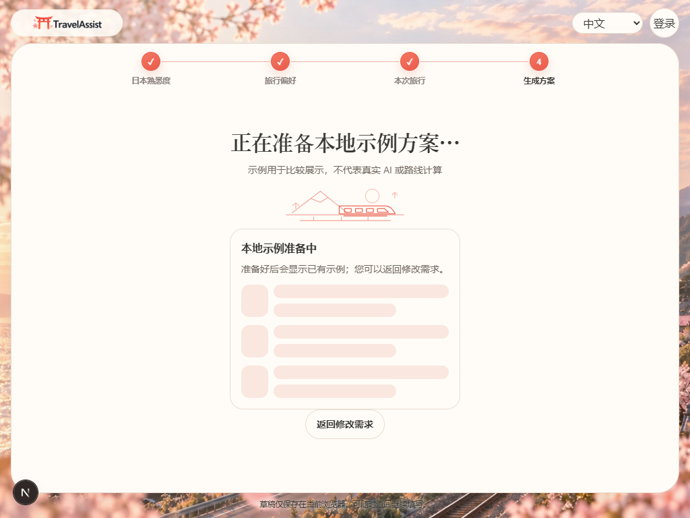
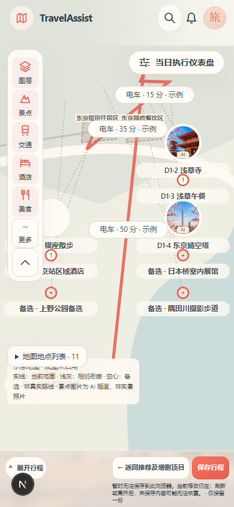
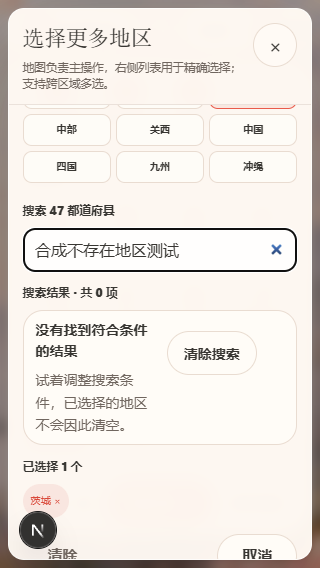
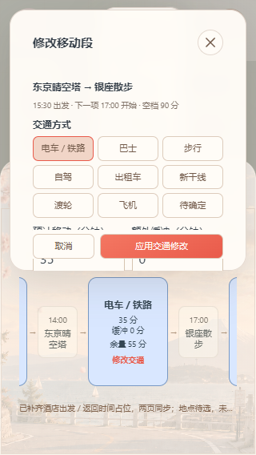

# TASK-067-B — 主系统状态运行时 QA

## 基线与边界

执行基线与交付前重新 fetch 的 develop 均为 `3a2779aee65c7335413adcc53ee5b4f7135c654c`，没有漂移。Task 发布 head 为 `3bd28dc789bd54030a7768d7ac760a8f64c4fbf1`；实现从 develop 的独立干净 worktree 开始，未从 publication branch 实现。原工作区 detached `5240ff8` 和未跟踪 `outputs/` 保留。

前置已核对：1.20 = B / 已完成 / Frozen v0.1（PR #390 已合并）；3.1 = B / 已完成。3.7 由本 Task 单项授权 B，开始提交 `ea32ef9` 仅发布任务文件及记录“进行中”。

完整读取 Task、Codex、Owner 修订、1.20 Frozen 设计、1.13 final closeout / tokens v1.1 / accessibility v1.2，审计既有共享 Button/SectionHeader 以及十个主系统 surface。写代码前读取安装包中 Next 16.3.4 的 Server/Client 与 error-handling 指南。

仅改变真实现有状态的显示及必要的失败保护。没有新增 API、DB、schema、migration、Provider/AI/Engine/Booking/Payment 能力；没有启动4.15/4.16/4.18/4.19或修改7.3/7.8。未改 Grid tracks、breakpoints、宿主模态控制器或存储格式。无部署；只有仓库既有本地构建/制品验证。没有 Local Supabase 需求，未启动或声称执行 DB 验收。

## 十个区域审计

| 区域                        | 当前接入或保留                                                                          | 不虚构的能力                                           |
| --------------------------- | --------------------------------------------------------------------------------------- | ------------------------------------------------------ |
| Home                        | 保留公共 Hero/Header/CTA 与静态图基线；AI 提示复用 shared state                         | 无全页 Auth 错误，无人为背景加载                       |
| Start                       | hydration Skeleton；真实本地准备态；Storage 读/写失败；47都道府县零结果；返回和清除搜索 | 无服务器生成、假阶段、百分比或 ETA                     |
| Planner                     | 浏览器恢复完成前展示原壳内 Skeleton；局部保存/目录错误；空草稿目录                      | 无新 Store、空 canonical Trip 或远端资源读取           |
| Planner Map                 | 既有示意/列表 fallback、未启用和失败的安全说明；其余工作区保留                          | 无真实 Provider 调用、造路线或虚假重试                 |
| Recommendation / Right Rail | 审计后保留既有同步本地候选与 Drawer 结构                                                | 无 pending / 请求失败 / 零推荐的拥有方，不制造状态     |
| Timeline / Summary          | 现有景点为空和不足两个移动节点的局部 Empty；保持其他日期/类别                           | 无异步摘要或伪时长骨架                                 |
| Trip Detail                 | 继续共享 Planner；Empty、保存失败与读取失败局部说明；原保存记录/dirty/覆盖保护保留      | 无永久远端 Trip URL、权限/缺失或未知提交接线           |
| Route Preview               | disabled/loading/stale/no_route/unsupported/error/ready 区分；安全重试和 single-flight  | 仅既有开发 gate；生产 gate 保持关闭；只消费7.5规范结果 |
| AI Visual Shell             | 明确未接入；Send disabled；可输入/关闭；关闭 target 44px                                | 无请求、streaming、loading或重试                       |
| Modal / Drawer / Popover    | 状态内容继承现有 host；region modal、Planner overlay 与非模态 AI 验证                   | 不添加 trap/inert/controller，Tooltip 无新交互         |

## Frozen 行分类

[state-runtime-matrix.json](state-runtime-matrix.json)逐条关联全部48项 Frozen acceptance：

- `IMPLEMENTED_AND_TESTED`：31
- `ALREADY_SATISFIED_UNCHANGED`：3
- `CONDITIONAL_NOT_CURRENTLY_REACHABLE`：9
- `OUTSIDE_CURRENT_RUNTIME_CAPABILITY`：5
- `BLOCKED_BY_SEPARATE_OWNER`：0

**分类针对各行当前可达子集，必须同时读取 currentEvidence / limits；不是48项或31项完整未来组合场景 PASS。** R01/R04/T04 等未来异步能力、远端权限、AI运行时、unknown COMMIT 无拥有方时保持条件性/范围外。AC-42/48 是历史 TASK-066 的 docs-only 门禁，不得据此把 TASK-067 限制为文档；Frozen 原证据完全未改。

## 可重放自动验证

`gate-evidence.json`记录实际命令、计数、退出码、日志 SHA-256 和来源文件指纹。完整本地日志/原截图位于执行 worktree 的兄弟目录 `../`（仓库根 `.artifacts/task067/`，忽略提交）；提交的证据 JSON 保留每张截图名称与 hash；5张代表性原始PNG也随PR提交。QA 不使用私有账户或真实 Provider 内容。

```powershell
npm ci
node --import ./tests/register-route-ts.mjs --test "tests/*.test.mjs"
node --import ./tests/register-route-ts.mjs --test tests/task-067-main-system-state.test.mjs tests/task-025-2-concept-fidelity.test.mjs tests/task-023-planner-route-integration.test.mjs tests/browser-trip-save.test.mjs tests/task-008-planner.test.mjs tests/task-012-planner.test.mjs
npm run lint
npm run typecheck
npm run build
npm run format:check:deploy
npm run deploy:validate:local
npm run deploy:build:local
npm run deploy:verify-artifact
git diff --check
```

- 安装成功：395 packages，0 vulnerabilities。
- 修改前 clean-develop runtime 全仓 Node baseline：2598/2598，0 fail/skip。
- TASK-067 focused：37/37；上述相关组合回归：83/83。
- 最终全仓与构建结果以 [gate-evidence.json](gate-evidence.json) 的实际输出为准。
- 本任务无需执行 Local Supabase 或付费/线上服务验收。

浏览器沿用仓库的 Playwright + installed Edge harness 模式，实际运行本地页面，所有故障注入仅在测试进程内，生产代码没有 debug query/timer/fixture switch：

```powershell
$env:CODEX_PLAYWRIGHT_PATH='<installed Playwright module path>'
$env:NEXT_PUBLIC_MAPBOX_TOKEN=''
$env:ROUTING_PLANNER_QUERY_ENABLED='true'
$env:ROUTING_PROVIDER_MODE='evaluation'
$env:VERCEL_ENV='development'
node node_modules/next/dist/bin/next dev --hostname 127.0.0.1 --port 3167
# 在另一终端运行
$env:TASK067_URL='http://127.0.0.1:3167'
$env:TASK067_OUT='../browser-development-final'
node --import ./tests/register-route-ts.mjs tests/task-067-main-system-state.browser.mjs
```

生产模式检查从本地生产构建启动，且不传上述开发 gate：

```powershell
node node_modules/next/dist/bin/next start --hostname 127.0.0.1 --port 3168
# 在另一终端运行
$env:TASK067_URL='http://127.0.0.1:3168'
$env:TASK067_MODE='production-disabled'
$env:TASK067_OUT='../browser-production'
node --import ./tests/register-route-ts.mjs tests/task-067-main-system-state.browser.mjs
```

开发模式 [browser-development.json](browser-development.json)：4视口（1440×900、1024×768、390×844、320×568），36组检查、32截图。Route 网络以现有7.5规范 fixture 在浏览器中拦截，本地 Storage 仅使用合成数据。外部请求守卫禁用所有非 localhost/127.0.0.1 请求；实际外部请求计数为0，没有 live/paid Provider 调用。生产模式独立通过4视口、8组检查、8截图，Route disabled且没有query/retry控件，实际外部请求0、页面错误0，记录在 [browser-production.json](browser-production.json)。

## 可访问性与保持状态证据

- 一次简短 status/polite；阻断保存错误用 alert，并抑制重复工具栏公告；busy 仅受影响内容，状态文字放在 busy 区外。
- Skeleton 无可聚焦后代、aria-hidden、静态；浏览器 reduce 环境检查计算样式没有 animation。
- 新恢复/返回按钮和触及的 AI close 实测至少44×44；键盘 Enter、Tab、Escape路径、清除搜索回输入框、Route重试保留焦点、取消回标题、关闭回触发器。
- Route button normal/hover/focus/pending 共16项实际 computed-style 测量，最小普通文字对比度约10.64:1；未把HEX计算或旧珊瑚按钮当实测PASS。
- Map element identity/rectangle 在 query/error/retry 中保持；local wizard数据、已存Trip字节不因局部错误而改变；read失败不改变当前Trip。
- 16次立即激活正在执行的Route动作只发1次请求；error→retry→error→retry→ready以真实响应结论结束；取消后的晚到ready不能覆盖后续no_route。
- read故障/坏JSON不删除原记录，不自动写覆盖；Storage恢复后既有保存动作才显示成功；未知错误 canary 不出现在DOM。
- 320×568覆盖当前矮屏host并进行了截图人工查看；关键恢复文字可读，无页面横溢出。未执行物理移动设备软键盘、手工读屏听读、真实Mapbox加载/失败，也未认证所有历史小按钮或完整多语言UI。

## 必要修复记录与首轮诊断

| 复现                                  | 被违反的约束              | 最小修复与回归                                                   | 兼容性                  |
| ------------------------------------- | ------------------------- | ---------------------------------------------------------------- | ----------------------- |
| Route error.message含任意Provider文本 | 原始错误不进UI            | 固定category文案；canary纯测试和浏览器测试                       | 7.5契约不变             |
| 同一query快速重复触发                 | pending不能fan-out        | existing hook active guard + shared action ref guard；16次/1请求 | 不新增幂等系统          |
| Storage.setItem抛异常或JSON损坏       | 不能宣称已保存/丢原数据   | 安全提示、保留原记录；禁覆未读取记录；真实Storage故障测试        | key/schema/格式不变     |
| Start示例timer展示模拟完成阶段        | 本地计时不代表AI/路线计算 | 显式本地示例文字与静态Skeleton；返回保留输入                     | 既有timer及生成数据不变 |
| Planner宿主CSS覆盖中性恢复按钮        | 新状态按钮对比/最窄宽度   | 限定shared class优先级与footer换行；实际对比度/320px截图         | 不改palette或Grid       |

首轮全仓不是PASS：2634项中2失败。TASK-033旧AI文案断言跟随本次明确“尚未接入”文案更新，disabled/标签/焦点约束保留；资产nightly dry-run在全仓与构建并跑时达到既有30秒子进程超时，停止重构建后独立重跑全仓，不改测试超时/断言。新增地区Empty测试后最终数量为2635。

浏览器初期两次 harness 校准失败分别是 about:blank 的 localStorage 访问以及把关闭后仍保持 no_route 的面板当成 idle；修正测试origin guard与步骤顺序，没有修改产品去迎合错误测试。测试新增、格式化过程中曾有 typecheck 缺少styles import、lint unused directive以及3个格式文件失败，均在最终gate前修复。日志不将这些首轮失败隐藏为PASS。

既有非失败警告：npm的deprecated包/allow-scripts提示、Node MODULE_TYPELESS_PACKAGE_JSON；不修改package依赖来隐藏它们。

## 提交与验收

只允许一个 Draft PR → develop；Issue #391保持Open；3.7交付候选为 B / 待审查。最终不可变head及workflow_dispatch exact-head Quality gate回执写入PR交付正文与最终答复，避免仓库内文档将自身最终commit写入后再次改变head。所有本地受测 runtime/test 源码用 SHA-256 绑定；最后文档/PR编号提交后未改变runtime。

完整交付见 [Result](../../tasks/RESULT-TASK-067-b-wbs-3-7-main-system-state-runtime.md)。不自动合并，不标记已完成，不启动其他WBS。

## 代表性原始截图










