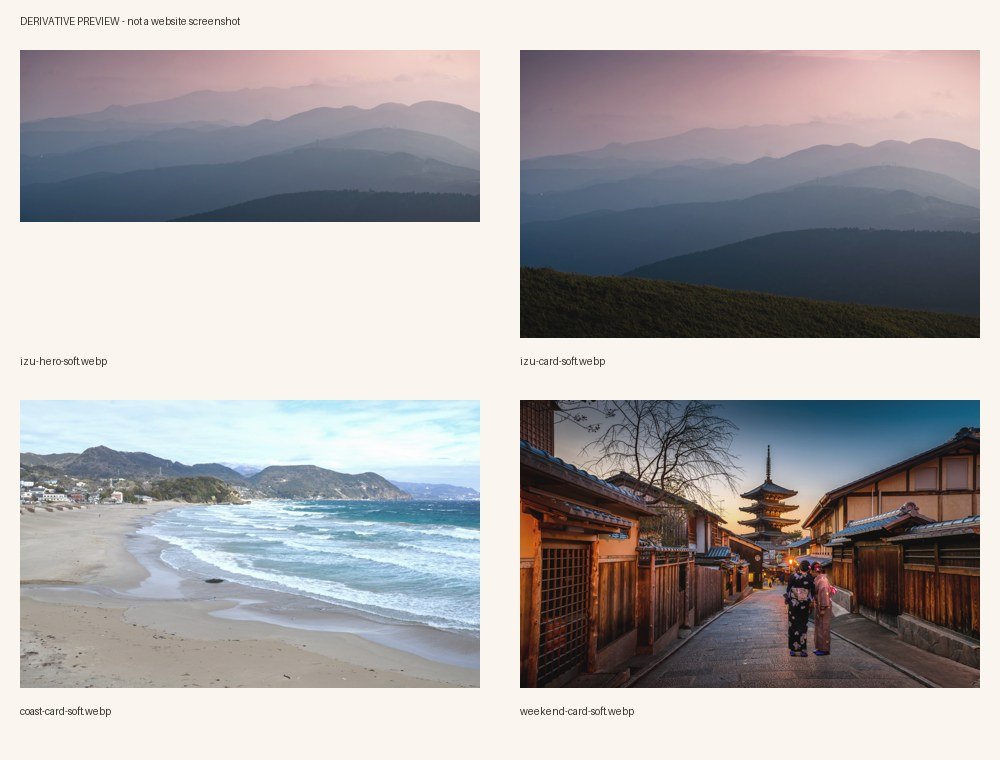

# WBS-5.1-B-COVERS — 实际素材检查

核验日期：2026-09-05（Asia/Tokyo）。Owner B；Issue #70；PR #68 保持 Draft。本文是照片素材验收，不是网页截图或浏览器验收。



## 原图与环境

- 工具环境：`F:\travelassist-covers-91b2462bddd74ef2ac7ebf039e57235d\venv`，完全在仓库外。Python 3.13.5；Pillow 12.3.0；WebP 编解码支持正常；`pip check` 无损坏依赖。
- 原图缓存为该专用目录下 `cache/`，临时目录 `tmp/`、字节码 `pycache/`、输出 `exports/` 为独立目录；网站依赖未安装或修改。原图、venv、合成测试图、原始响应头均未加入 Git。
- 三张来源、作者、CC0 文件页记录及社区历史许可审查备注见 [ATTRIBUTION](../../../public/media/personal-center/trips/ATTRIBUTION.md)。已核对文件页而非站点页脚；未声称 Commons 社区许可审查完成。
- 三张原图字节、原尺寸、JPEG 签名、完整主图解码通过，SHA-256 均不同；伊豆、海岸同时匹配原有 SHA-1。京都只记录本次计算哈希，没有预固定 SHA-1。

## 实际执行与遇到的问题

1. 原脚本语法检查与既有 **8/8** 离线测试通过。
2. 首次联网执行在伊豆下载时报 `CERTIFICATE_VERIFY_FAILED: certificate has expired`，未产生真实封面。改用系统 `curl 8.21.0 / Schannel` 下载同一 HTTPS 原图，未使用 `-k`、未知代理或任何 TLS 绕过。三次 curl 请求均 HTTP 200 / image/jpeg，原字节长度一致。请求次数：伊豆共 2 次（Python 失败 + curl 成功），海岸 1 次，京都 1 次；没有 429 或无限重试。
3. 初次原图校验发现海岸格式被 Pillow 标为 MPO。调查确认下载 bytes=4218401、SHA-1=`a3ec6a018cf0d516e2ebd90f4a0f551718b386a6` 与原 pin 和 Commons 文件页一致，尺寸仍 6016×4000，并非原图更新或下载错误。
4. 局部修复：仅该源记录 `pillow_format=MPO, frames=2`，保留原字节、尺寸与 SHA-1 校验，额外要求 JPEG 签名、预期帧数并明确取主帧 0。其他源仍只接受单帧 JPEG。新增 MPO 正向、错误格式/帧数、错误哈希测试。
5. 将脚本写死的核验日期改为显式 `--license-checked-date`；未提供时记录 null，不自动冒充已检查。新增有效日期、错误/未来日期测试，既有管线测试覆盖 null 与显式日期。预览标题去除过程性的 pending 字样，仍明确非网页截图。
6. 修复后脚本语法检查及 **13/13** 离线测试通过。在已校验原图缓存上实际执行下列命令，成功导出 3 场景 / 4 WebP。没有改变处理参数或裁切中心，没有更换图片来源。

```powershell
$coverWork = 'F:\travelassist-covers-91b2462bddd74ef2ac7ebf039e57235d'
$coverPython = Join-Path $coverWork 'venv\Scripts\python.exe'
$env:TEMP = Join-Path $coverWork 'tmp'
$env:TMP = $env:TEMP
$env:PYTHONPYCACHEPREFIX = Join-Path $coverWork 'pycache'
& $coverPython -m py_compile tools/assets/personal-center/prepare_trip_covers.py tools/assets/personal-center/test_prepare_trip_covers.py
& $coverPython -B -m unittest discover -s tools/assets/personal-center -p 'test_*.py' -v
& $coverPython -B tools/assets/personal-center/prepare_trip_covers.py --output (Join-Path $coverWork 'exports') --cache (Join-Path $coverWork 'cache') --offline --timeout 35 --license-checked-date 2026-09-05
```

`exports` 是本次首次生成目录。复跑请选择新的输出目录，脚本拒绝覆盖现有目录。合成单元测试图片始终在自动清理的外部临时目录内，未当作实际交付。

## 逐张视觉检查

已实际打开四张完整成品及 1000×760 `preview.jpg`，并对照三张原图的等比例缩小预览。图片查看工具最初因 Windows 沙箱访问失败，随后使用已授权文件读取将实际图片显示出来；不是因工具失败而跳过视觉检查。

| 文件                     | 检查结果                                                                                                                                   |
| ------------------------ | ------------------------------------------------------------------------------------------------------------------------------------------ |
| `izu-hero-soft.webp`     | Passed：横向多层山脊、粉暖天空与蓝色山影保留；无错误截断主体、文字或按钮。雾感来自原摄影，不是纯色占位；未来左侧文字遮罩仍由网页另行实现。 |
| `izu-card-soft.webp`     | Passed：同一伊豆原图的独立卡片裁切，保留前景草坡与山体层次；与 Hero 共源符合 Task，并未冒充第四独立场景。                                  |
| `coast-card-soft.webp`   | Passed：完整海岸弧线、沙滩及浪花清楚，海水仍保留蓝绿色；轻暖处理没有明显发黄或抹平细节。                                                   |
| `weekend-card-soft.webp` | Passed：京都街道、塔顶及前景行人完整，木质建筑与傍晚灯光保留；原摄影本身为较暗傍晚场景，未强行提成白昼或做额外调色。只标为京都周末示例。   |
| `preview.jpg`            | Passed：四格对应四个导出文件，名称可读，三个场景不同；仅素材联系预览，未拼装或宣称网页验收。                                               |

## 可机器复核的检查

[checks.json](checks.json) 记录实际解码、尺寸、RGB、预算、RIFF 块、无 EXIF/GPS/XMP、SHA-256 和 Git blob。

独立核验还从三张原图重新执行同一裁切、调色与编码，逐字节比较四份结果及 manifest 的尺寸、字节、来源、作者、处理参数、quality；这不是在成品上二次调色。预览 JPEG 可完整解码。四张成品 `synthetic=false`，各条目 `runtime_integrated=false`。

## 格式、范围与发布

- 本 Task 新增及独占 JSON/MD 的 Prettier 检查与 `git diff --check` 均通过。Master WBS 在 origin/develop 和工作区都存在既有格式问题；只新增本行，未重排旧表。没有声称全仓格式通过。
- Master WBS 只新增本 Task 一行。原文件去除此行后必须与启动基线逐行相等，保留父 5.1/5.2 及所有其他 Task 状态；不为格式要求重排其他行。
- 既有身份标志、默认头像、鸟居、纹理、首页及 Step 1–5 素材、`src/`、package 文件均保持不变。
- 网站 lint：Not run — asset-only；typecheck：Not run — asset-only；build：Not run — asset-only；浏览器验收：Not run — asset-only。
- GitHub 上传后以提交 SHA 调用 Contents API，解码远端 Base64，并逐一比较实际 bytes、SHA-256 与 Git blob。回读记录位于后续发布的 [remote-readback.json](remote-readback.json)，不以本地文件存在代替上传证明。
- 完整追踪：[Result](../../tasks/RESULT-WBS-5.1-b-trip-cover-generation-upload.md)。保持 Issue Open / PR Draft / WBS 待审查；网页未接入，未合并 develop。
