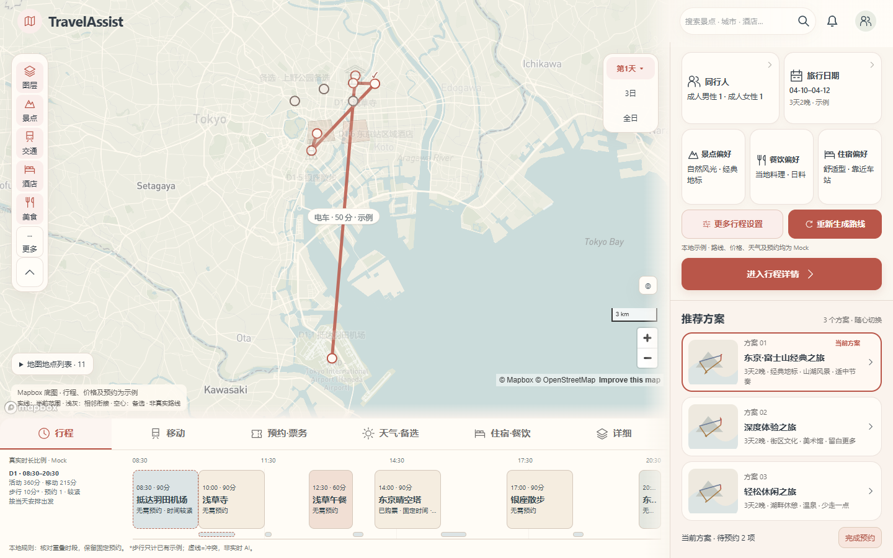
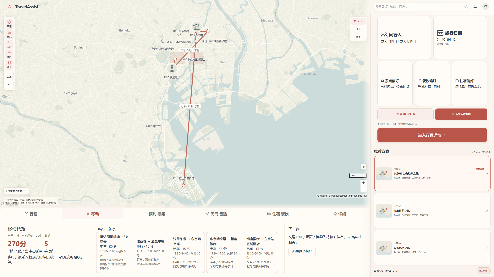
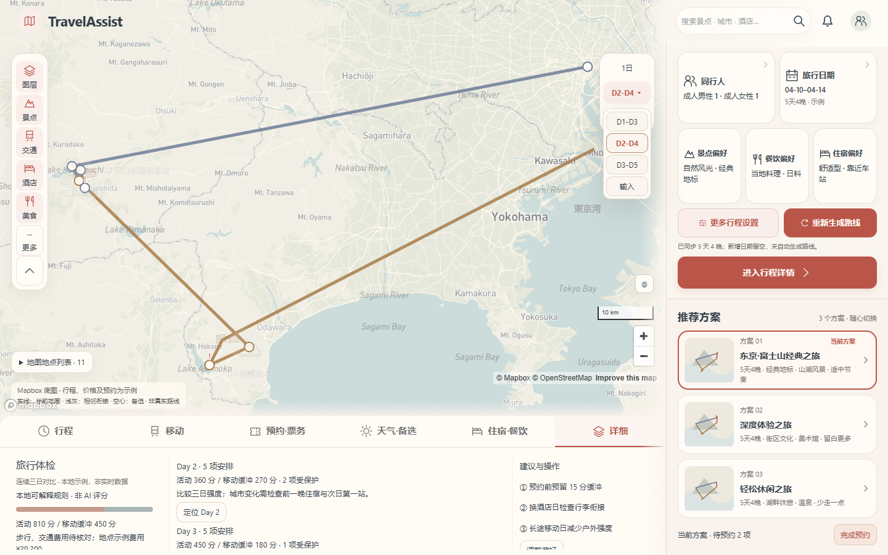

# Planner responsive density QA

Issue #135 / TASK-012-A follow-up。比较基线 `c88d338`（已合并 v0.5），本次不重新设计推荐区。

## Reports

- [九视口真实地图 + 冻结区域比较](mapbox/report.json)
- [九视口 fallback + 冻结区域比较](fallback/report.json)
- [最终生产构建九视口真实地图](production/mapbox/report.json)
- [生产构建六视口 Mapbox / Detail 回归](regression/qa-mapbox.json)
- [生产构建六视口 fallback / Detail 回归](regression/qa-fallback.json)
- [生产构建双引擎交互回归](regression/interaction-qa.json)

production 九视口报告中的 recommendations: not compared 仅表示该轮没再次启动旧基线；冻结比较由前两份报告及六视口生产回归单独证明。

## Screenshots

每个尺寸的推荐区前后截图分别在 `mapbox/recommendations-before-WIDTH.png` 和 `mapbox/recommendations-after-WIDTH.png`；fallback 目录亦有同名证据。几何和文字程序断言完全相同，不宣称地图截图像素相同。

手机继续使用既有抽屉和横向可滚动时间轴以保留触控大小；桌面 dock 始终为 viewport 的 25%，不是 min/max 钳制值。时间轴间隔保留真实时长语义，不用虚构节点填白。

## Reproduce

运行 `tools/qa/planner-density-check.mjs`，通过环境变量 `DENSITY_URL` 指向本地服务；`DENSITY_LIVE=1` 验证真实地图，默认强制 fallback。`DENSITY_BASELINE_URL` 可指定同时运行的旧构建进行冻结区域比较；`DENSITY_OUT` 可隔离输出。通过 `PLAYWRIGHT_MODULE` / `CHROME_EXE` 指定现有运行时，不增加项目依赖。

现有 `task-012-planner-check.mjs` 和 `task-012-interactions-check.mjs` 支持 `TASK_012_QA_OUT`，避免覆盖历史交付证据；底栏断言更新为本次用户确认的实际 25dvh。
